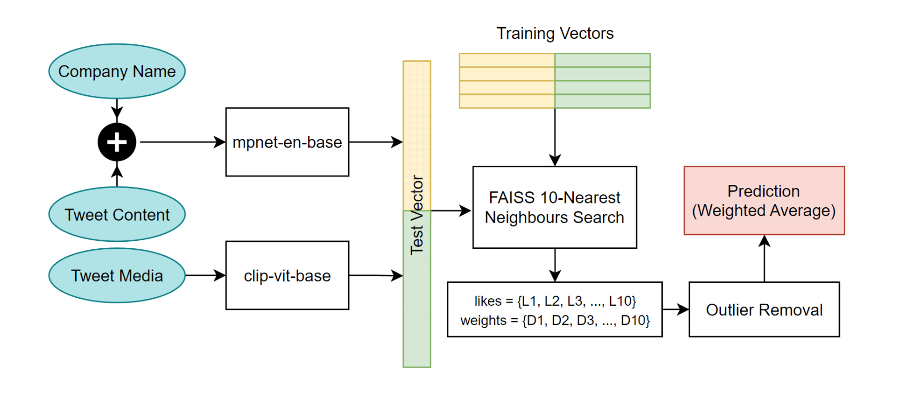

## Task 1: Behaviour Simulation

#### General Pipline

<p align="center">
  
</p>

#### Reproduce Results

```bash
>> pip install -r requirements.txt
>> python finetune-sbert.py
>> python gererate-embeddigns.py
>> python embedding-search.py
```
